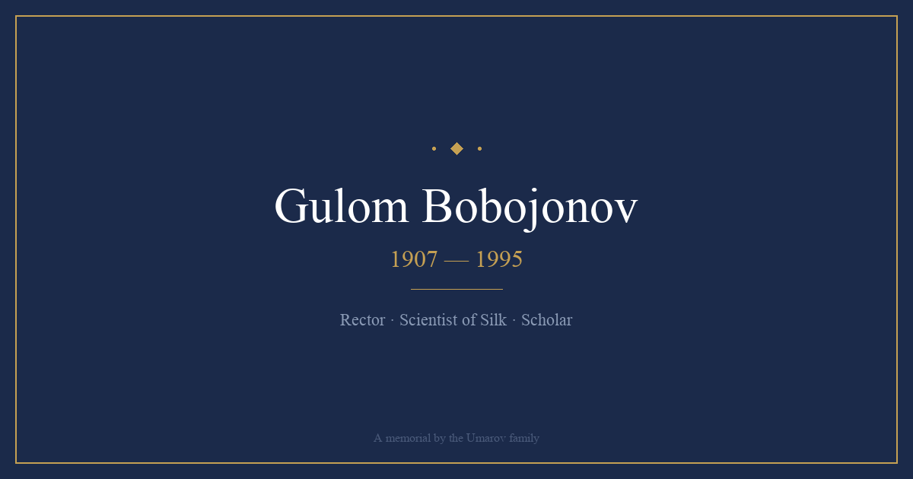

# Gulom Bobojonov Memorial

**🌐 Live: [www.gulam-babodjanov.com](https://www.gulam-babodjanov.com)**

A memorial website dedicated to **Gulom Bobojonov (1907–1955)** — orphan, scholar, rector, and pioneering scientist of silk from the village of Ikan near Turkestan, South Kazakhstan.



## About

Gulom Bobojonov rose from a peasant village orphan to become one of Central Asia's foremost agricultural scientists. Losing his father at age one, raised by his grandfather and then his mother, he fought through poverty and famine to earn an education. He became a rector, a candidate of agricultural sciences, and a leading authority on sericulture (silk science).

During WWII, his research on parachute silk directly served the Soviet military effort — making him one of two Umarov family great-grandfathers who served at the highest levels of the Uzbek SSR during wartime (alongside Amin Niyazov, the republic's financial commissar).

He died on May 21, 1955, at just 47–48 years old, leaving behind his wife Habiba and seven young daughters.

## Features

- 📖 **Full biography** — From orphaned childhood in Ikan to rector and scientist
- 🏘️ **Ikan section** — History of the ancient village near Turkestan
- 🐛 **Sericulture science** — His contributions to silk research
- 📸 **Photo gallery** — Historical photographs from family archives
- ⏳ **Interactive timeline** — Key life events
- 🌍 **3 languages** — English, Russian, Uzbek
- 🌓 **Dark/light mode** — System-aware with manual toggle
- 📱 **Fully responsive** — Mobile-first design
- ⚡ **Static site** — Single HTML file, no build step

## Life Timeline

| Year | Event |
|------|-------|
| 1907 | Born in Ikan, near Turkestan |
| 1908 | Father dies — raised by grandfather, then mother |
| 1920s | Survives famine, earns education |
| 1930s | Rises through agricultural academy system |
| 1940–1945 | Parachute silk research for WWII military effort |
| 1955 | Dies at age 47–48, leaving wife and 7 daughters |

## Tech Stack

- Pure HTML/CSS/JavaScript (no framework)
- Hosted on [Vercel](https://vercel.com)
- Custom domain via Vercel DNS
- SVG favicon, Gemini-generated OG image

## Family

Gulom Bobojonov is the great-grandfather of the Umarov family. His line of science connects with the Niyazov line of statesmanship through marriage.

**Related memorials:**
- [Aminjan Niyazov](https://www.amin-niyazov.com) — First Secretary of CP Uzbekistan (1903–1973)
- [Giyas Umarov](https://www.giyas-umarov.com) — Founder of Heliotechnology, Academician (1921–1988)

## Deploy

```bash
npx vercel --prod
```

## License

© 2024 Umarov Family. All rights reserved.
